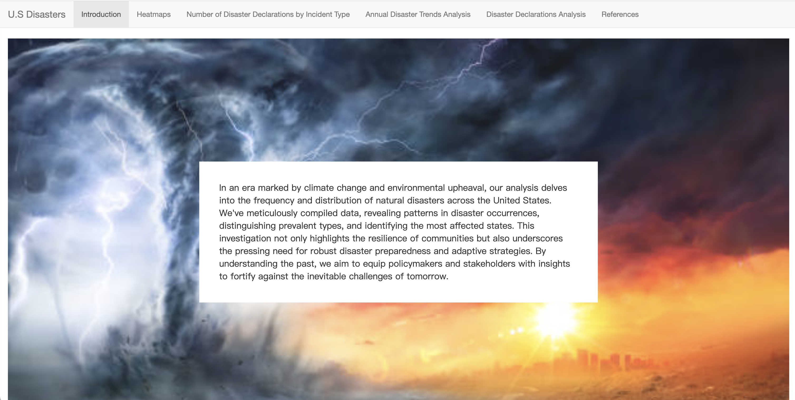

# Project 2: Shiny App Development

### [Project Description](doc/project2_desc.md)

Term: Spring 2024




## Project Title: The U.S. Disasters Analysis
Term: Spring 2024

+ Team #: Group 1
+ **Team members:**: 
+ Zhou, Jitian
+ Chen, Zhengfei
+ Tang, Chulin
+ Liu, Jiaqi
+ Wang, Jingqi
	

+ **Project summary**:
+ We develop a Shiny App that provides an analysis of U.S. disasters using Disaster Declarations Summaries dataset available on the [OpenFEMA](https://www.fema.gov/openfema-data-page/disaster-declarations-summaries-v2) website. This application offers in-depth insights into disaster trends and impacts across the country. 
+ In an era marked by climate change and environmental upheaval, our analysis delves into the frequency and distribution of natural disasters across the United States. We've meticulously compiled data, revealing patterns in disaster occurrences, distinguishing prevalent types, and identifying the most affected states. This investigation not only highlights the resilience of communities but also underscores the pressing need for robust disaster preparedness and adaptive strategies. By understanding the past, we aim to equip policymakers and stakeholders with insights to fortify against the inevitable challenges of tomorrow. 

+ **[Shiny App Link](https://jingqiwang.shinyapps.io/TheUSDisastersAnalysisApp/)**

+ **Contribution statement**: ([default](doc/a_note_on_contributions.md)) All team members contributed equally in all stages of this project. All team members approve our work presented in this GitHub repository including this contributions statement. 

Following [suggestions](http://nicercode.github.io/blog/2013-04-05-projects/) by [RICH FITZJOHN](http://nicercode.github.io/about/#Team) (@richfitz). This folder is orgarnized as follows.

```
proj/
├── app/
├── lib/
├── data/
├── doc/
└── output/
```

Please see each subfolder for a README file.

